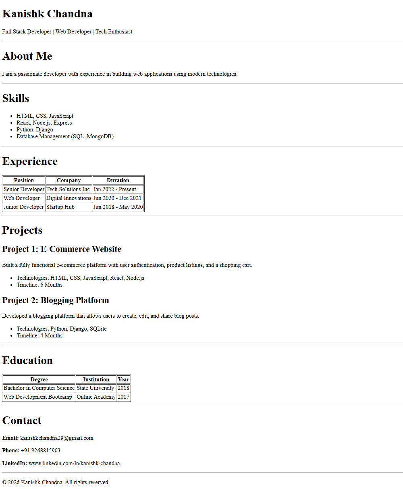

# HTML Resume Page

A simple, clean HTML resume webpage showcasing professional experience, skills, projects, and education.

## Screenshot



## About

This is a static HTML resume page for Kanishk Chandna, built using semantic HTML elements including tables for structured data display.

## Features

- **Personal Information**: Name, title, and professional summary
- **Skills Section**: List of technical skills and proficiencies
- **Work Experience**: Professional experience displayed in a structured table
- **Projects**: Detailed project descriptions with technologies and timelines
- **Education**: Academic background and certifications
- **Contact Information**: Email, phone, and LinkedIn profile

## Technologies Used

- HTML5
- Semantic HTML elements
- Tables for structured data

## How to View from GitHub

### Option 1: Clone the Repository
```bash
git clone <your-github-repo-url>
cd html-resume-page
```
Then open `index.html` in your browser.

### Option 2: Download ZIP
1. Go to the GitHub repository
2. Click on the green "Code" button
3. Select "Download ZIP"
4. Extract the ZIP file
5. Open `index.html` in any web browser

### Option 3: View Directly
You can also view the page directly using GitHub Pages or by opening the raw HTML file URL in your browser.
